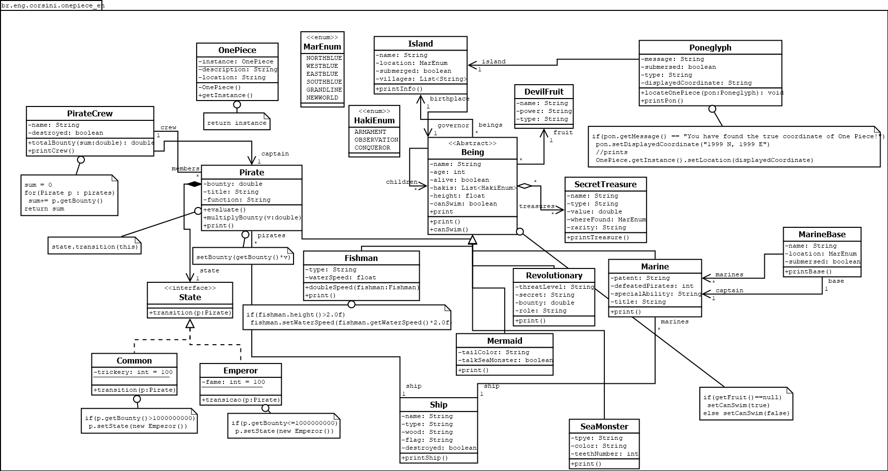
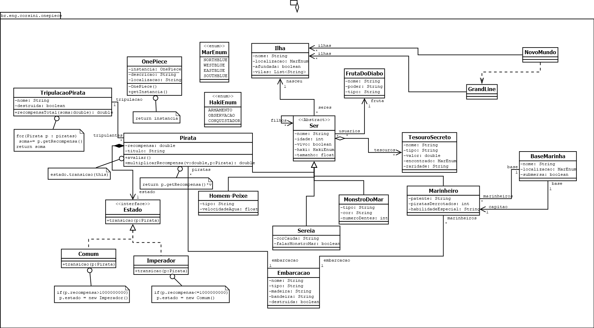

# 🏴‍☠️ One Piece World


This repository is a Java Project about the **One Piece World**, the goal is to develop around 20 classes and interacting them with inheritances, polymorphism etc.

## 📚 Project Overview

- Built with **Java** (Maven project structure).
- Includes **source code, UML diagrams, and project configuration**.

## 📂 Repository Structe

```plaintext
one-piece-world/
├── src/
│   └── main/
│       └── java/br/eng/corsini/        
│           └── onepiece_en           # English Package  
│           └── onepiece_ptbr         # Brazilian Portuguese Package  
│           └── MainBr.java           # Brazilian Portuguese Main Class
│           └── MainEn.java           # English Main Class  
│       └── resources/                # Resources folder  
|   └── test/
├── .gitignore                        # Git ignore file
├── LICENSE                           # MIT Student License
├── README.md                         # Project documentation
└── pom.xml                           # Maven configuration file
```

---

## 🛠️ Tools & Technologies

- **Java** (main programming language)
- **Maven** (dependency and build management)
- **Dia** (diagram design tool)
- **Git/GitHub** (version control and hosting)

---

## 🖼️ Project Diagram

- English version:


- Portuguese version:


---

## How to run

1. **Clone the repository**  
   ```bash
   git clone git@github.com:pedrocorsini/one-piece-world.git
   ```
2. **Pull the lastest changes**
   ```bash
   git pull origin main
   ```
3. **Compile the project**
   ```bash
   mvn clean compile
   ```
4. **Run the project**
   ```bash
   mvn exec:java -Dexec.mainClass="br.eng.corsini.<MainClass>"
   ```

## ✨ Author

👤 **Pedro Corsini**  

---

⭐ If you like this project, consider giving it a star!  
